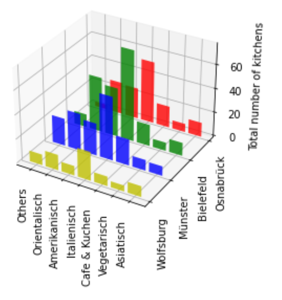

# LetsScrape
## 1. Overview 


 This is our final project for the course "Scientific Programming in Python" of the University Osnabrück. Our goal is to compare the range of restaurants in different german cities
 available on Lieferando (www.lieferando.de). To gather the data we use Selenium (https://selenium-python.readthedocs.io) and matplotlib (https://matplotlib.org) 
 to visualise the results. 

 ## 2. Installation 
 ### General requirements
 <ul>
 <li>Working python enviroment with version >= python 3.7 (https://www.python.org) </li> <br>
 <li>Or working Conda environment with python version >= 3.7 <a href="https://docs.conda.io/projects/conda/en/latest/user-guide/install/index.html">(Install Conda)</a> </li><br> 
 <li>Chromedriver (https://chromedriver.chromium.org/downloads)<br> Install the chromdriver which fits your brower version. You can see the chrome version under Settings>About Chrome. </li> <br>
 </ul>

 ### Installation process
 Open a terminal in the project folder and enter <br>

     $ pip -r install requirements.txt

  You need to change the PATH in [`scraper.py`](./scraper.py) in <b>line 17 and 18</b> depending on your operating system. 

  #### For Mac
  Attention: You might need to give special permissions to your chromedriver to work: <br>
 
  ```Python 
 PATH = "PATH TO YOUR DRIVER"  
 driver = webdriver.Chrome(PATH)  
  
  ```
  #### For Windows 
  ```Python 
 PATH = "PATH TO YOUR DRIVER"  
 driver = webdriver.Chrome(executable_path=PATH)  
  
  ```
  #### For Ubuntu Linux 
  

  ## 3. How to use the program
  Run lets_scrape.py 

     $ python lets_scrape.py

  and then follow the dialoge. As a result there should appear up to two pdf files in the Project folder.

  ### Troubleshooting and Remarks


   #### Entering adresses <br>
   <ul><li>Lieferando might not find the city. You may use an actual adress or add " Hbf" to the city name.</li> <br>
   <li>For cities which might occur multiple times in germany, you may enter the zip code to the city name. </li></ul>
   
   ##Motivation and Decision making
   
   Since we are students, we most likely make up a big part of Lieferando's (and other delivery services') customers
   and wanted to have an option to compare different citys and their offers in terms of diversity, delivery costs, delivery time etc.
   
   ## 4. Motivation, Goal and Result
   
   Early on we agreed to use Webscraping and Matplotlib for the project. Since we are students, we most likely make up a big part of Lieferando's (and other delivery services') customers and we noticed that the Lieferando offer in Osnabrück is quite homogeneous. Mostly pizza and burger. We agreed to scrape information on Lieferando.de to compare Osnabrück with other german cities. <br>
   
   Our goal is to compare differnt locations in Germany in terms of diversity, delivery costs, delivery time, ratings etc. and to visualise the results in a convincing and informative way. <br>
   
   As development moved on we realised that Lieferando.de has a quite liberal policy for restaurants to choose their kitchens. As a exsample a restaurant can have the kitchens "Italienisch, Italienische Pizza, Pasta" which all can be categorized as Italian. So we decided to make our own categories to reduce the number of kitchens, but of course it is still possible to apply the kitchens on Lieferando.de. <br>
   
   As you can see there are plenty of kitchens: 
   
   
   
   
   This is how the heatmap looks like if one applies our categorization:
   
   
   
   
   ## 5. Structure 
   
   
   
   
   
   
   


